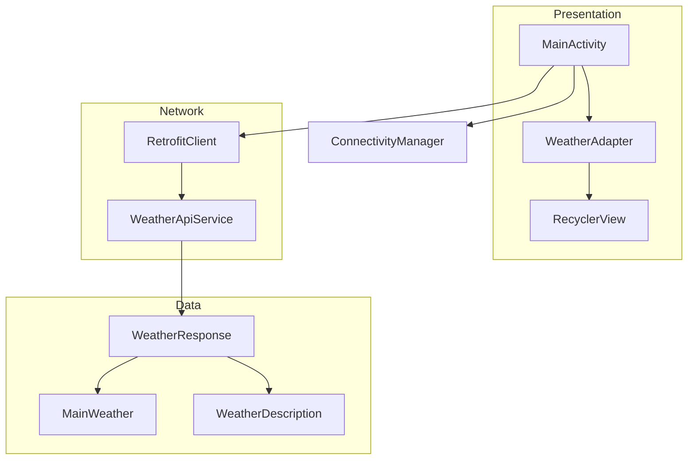

# Design Document

## Overview

APIConnectApp is an Android application that demonstrates networking capabilities by fetching weather data from the OpenWeatherMap REST API. The app uses Retrofit for HTTP communication, Gson for JSON parsing, and follows Android best practices for UI updates and error handling.

The architecture follows a simple layered approach:
- **Presentation Layer**: MainActivity with RecyclerView and adapter
- **Network Layer**: Retrofit client and API service interface
- **Data Layer**: Data classes representing API responses

## Architecture



## Components and Interfaces

### 1. WeatherApiService Interface

Defines the API endpoint for fetching weather data.

```kotlin
interface WeatherApiService {
    @GET("weather")
    fun getWeather(
        @Query("q") cityName: String,
        @Query("appid") apiKey: String,
        @Query("units") units: String = "metric"
    ): Call<WeatherResponse>
}
```

### 2. RetrofitClient Object

Singleton providing configured Retrofit instance.

```kotlin
object RetrofitClient {
    private const val BASE_URL = "https://api.openweathermap.org/data/2.5/"
    
    val instance: WeatherApiService by lazy {
        Retrofit.Builder()
            .baseUrl(BASE_URL)
            .addConverterFactory(GsonConverterFactory.create())
            .build()
            .create(WeatherApiService::class.java)
    }
}
```

### 3. MainActivity

Main activity handling user interaction, API calls, and UI updates.

```kotlin
class MainActivity : AppCompatActivity() {
    // UI components
    private lateinit var searchEditText: EditText
    private lateinit var searchButton: Button
    private lateinit var weatherRecyclerView: RecyclerView
    private lateinit var progressBar: ProgressBar
    private lateinit var weatherAdapter: WeatherAdapter
    
    // Methods
    fun onCreate(savedInstanceState: Bundle?)
    fun setupUI()
    fun isNetworkAvailable(): Boolean
    fun fetchWeather(cityName: String)
    fun showError(message: String)
    fun showLoading(show: Boolean)
}
```

### 4. WeatherAdapter

RecyclerView adapter for displaying weather data.

```kotlin
class WeatherAdapter(
    private var weatherList: MutableList<WeatherResponse>
) : RecyclerView.Adapter<WeatherAdapter.WeatherViewHolder>() {
    
    fun updateData(newWeather: WeatherResponse)
    fun clearData()
    
    class WeatherViewHolder(itemView: View) : RecyclerView.ViewHolder(itemView) {
        fun bind(weather: WeatherResponse)
    }
}
```

## Data Models

### WeatherResponse

```kotlin
data class WeatherResponse(
    @SerializedName("name")
    val cityName: String,
    
    @SerializedName("main")
    val main: MainWeather,
    
    @SerializedName("weather")
    val weather: List<WeatherDescription>
)
```

### MainWeather

```kotlin
data class MainWeather(
    @SerializedName("temp")
    val temperature: Double,
    
    @SerializedName("humidity")
    val humidity: Int,
    
    @SerializedName("feels_like")
    val feelsLike: Double
)
```

### WeatherDescription

```kotlin
data class WeatherDescription(
    @SerializedName("main")
    val main: String,
    
    @SerializedName("description")
    val description: String,
    
    @SerializedName("icon")
    val icon: String
)
```

## Correctness Properties

*A property is a characteristic or behavior that should hold true across all valid executions of a system—essentially, a formal statement about what the system should do. Properties serve as the bridge between human-readable specifications and machine-verifiable correctness guarantees.*

Based on the acceptance criteria analysis, the following properties can be formally tested:

### Property 1: JSON Parsing Round Trip

*For any* valid WeatherResponse object, serializing it to JSON and then deserializing it back should produce an equivalent object.

**Validates: Requirements 3.3**

This is a round-trip property ensuring Gson correctly handles the data model serialization/deserialization.

### Property 2: Graceful Error Handling for Invalid Data

*For any* malformed, empty, or invalid JSON string, attempting to parse it as a WeatherResponse should either return null or throw a handled exception without crashing the application.

**Validates: Requirements 8.4**

This is an error condition property ensuring the app handles bad data gracefully.

## Error Handling

### Network Errors

| Error Type | Detection | User Feedback |
|------------|-----------|---------------|
| No Internet | ConnectivityManager check | Snackbar: "No internet connection" |
| API Error (4xx/5xx) | Response.isSuccessful = false | Snackbar: "Error fetching weather data" |
| City Not Found (404) | Response code 404 | Snackbar: "City not found" |
| Timeout | SocketTimeoutException | Snackbar: "Request timed out" |
| Parse Error | JsonSyntaxException | Snackbar: "Error processing data" |

### Error Handling Flow

```mermaid
flowchart TD
    A[User taps Search] --> B{Network Available?}
    B -->|No| C[Show "No internet" Snackbar]
    B -->|Yes| D[Show ProgressBar]
    D --> E[Make API Call]
    E --> F{Response OK?}
    F -->|Yes| G{Parse Success?}
    G -->|Yes| H[Update RecyclerView]
    G -->|No| I[Show Parse Error]
    F -->|No| J{404?}
    J -->|Yes| K[Show "City not found"]
    J -->|No| L[Show Generic Error]
    H --> M[Hide ProgressBar]
    I --> M
    K --> M
    L --> M
    C --> N[Stay on current screen]
```

## Testing Strategy

### Unit Tests

Unit tests will verify specific examples and edge cases:

1. **Data Model Tests**
   - Verify WeatherResponse fields are correctly mapped
   - Test Gson annotations work correctly
   - Test edge cases with missing optional fields

2. **RetrofitClient Tests**
   - Verify singleton instance is created
   - Verify base URL is correct
   - Verify Gson converter is configured

3. **WeatherAdapter Tests**
   - Test data binding to ViewHolder
   - Test updateData() adds items correctly
   - Test clearData() empties the list

### Property-Based Tests

Property-based tests will use a PBT library (e.g., Kotest or jqwik) to verify universal properties:

1. **JSON Round Trip Property** (Property 1)
   - Generate random valid WeatherResponse objects
   - Serialize to JSON, deserialize back
   - Verify equivalence
   - Minimum 100 iterations
   - **Tag: Feature: api-connect-app, Property 1: JSON Parsing Round Trip**

2. **Error Handling Property** (Property 2)
   - Generate random malformed JSON strings
   - Attempt parsing
   - Verify no crashes, graceful handling
   - Minimum 100 iterations
   - **Tag: Feature: api-connect-app, Property 2: Graceful Error Handling**

### Integration Tests

- Test actual API calls with mock server (MockWebServer)
- Verify end-to-end flow from search to display

### Testing Framework

- **Unit Tests**: JUnit 4 with AndroidX Test
- **Property-Based Tests**: Kotest property testing
- **Mocking**: MockK for Kotlin mocking
- **UI Tests**: Espresso for instrumented tests

